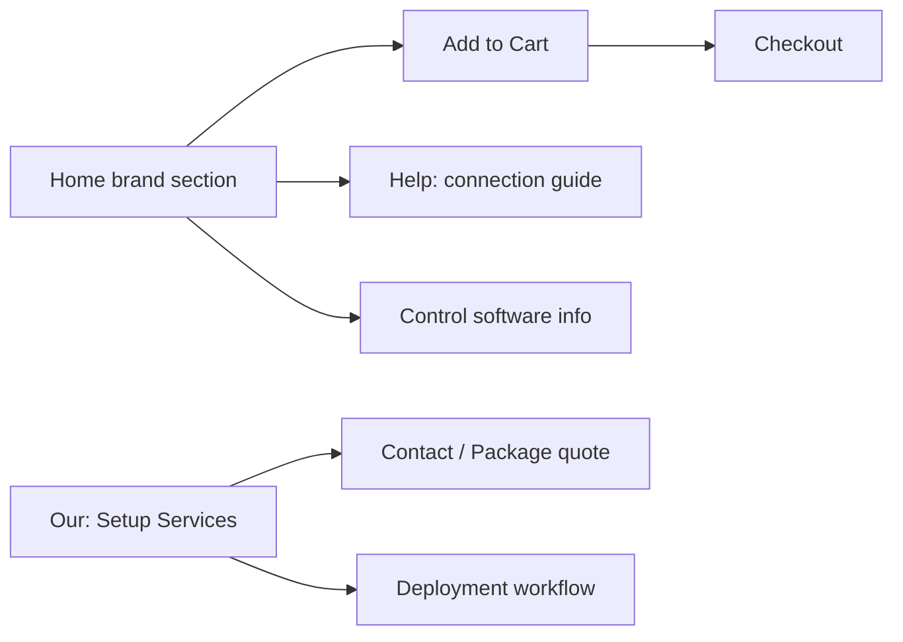

# Reference Site Audit — phonefarm.cyou (Cyou Phone Farm)

**Reference URL (structure only):** https://www.niaozun.shop/  
**Material library root:** `D:\网站搭建素材库`  
**Site pack (preferred):** `D:\网站搭建素材库\FINAL_phonefarm_6sites_package_CN\02_六个网站分类素材\03_phonefarm.cyou_full_service_site`  
**Fallback pack:** `D:\网站搭建素材库\02_six_website_ready\phonefarm.cyou_full_service_site`  
**Brand:** Cyou Phone Farm · Guangzhou, China  
**Positioning:** Full-service phone farm setup (hardware + remote control + group control + deployment + support), with shop parity to reference.

---

## 1. Page List (Reference → Ours)

| Reference | Ours |
|-----------|------|
| Home (product info + brand boxes + software + stats) | `/` |
| Shop / product listing by brand | `/shop`, `/products` |
| Product detail + Add to Cart + price | `/products/[slug]` |
| Help / Document Center (`/help/11/xx`) | `/help`, `/help/[slug]` |
| FAQ themes on home + help | `/faq` |
| Control software section | `/services#control-software`, products `control-software` |
| Mirror Software VIP products | Service SKUs + setup packages (not third-party CDKEY brands) |
| About / trust | `/about` |
| Contact / CS | `/contact` |
| Cart / checkout flow | Login → order → USDT |
| — | `/services` (enhanced) |
| — | `/deployment` (workflow) |
| — | `/services/packages` (quote bundles) |

---

## 2. Navigation (Reference)

- Product information (What is Phone Farm, single IP)
- Shop by **device brand box**: Samsung, Oppo, Xiaomi, OnePlus, Pixel
- **Mirror Software VIP** (CDKEY products)
- **Control Software** (free/paid mirror tools descriptions)
- Help / Document Center
- Global order stats by country
- Add to Cart sitewide

**Our nav:** Home · Shop (brand filters) · Products · **Setup Services** · Deployment · Help · FAQ · About · Contact · Login

---

## 3. Homepage Modules (Reference)

1. Product information — What is Phone Farm
2. Single machine single IP topic link
3. Trust — 5-year brand (we: since 2017 Guangzhou factory)
4. Device connection video guide → Help center
5. **Samsung Box** product grid (4 SKUs + price + Add to Cart)
6. **Oppo Box** grid (4 SKUs)
7. **Xiaomi Box** grid (4 SKUs)
8. **OnePlus Box** grid (4 SKUs)
9. **Pixel Box** grid (4 SKUs)
10. **Mirror Software VIP** (discounted CDKEY style)
11. **Control Software** descriptions (4 software types)
12. Global equipment order quantity by country

**Our homepage adds:** One-stop setup hero, deployment workflow, service packages CTA, Hardware+Software+Support, factory photos, expanded FAQ, contact channels.

---

## 4. Product Categories (Reference)

| Reference category | Our category slug |
|--------------------|-------------------|
| Samsung Box | `samsung-box` |
| Oppo Box | `oppo-box` |
| Xiaomi Box | `xiaomi-box` |
| Oneplus Box | `oneplus-box` |
| Pixel Box | `pixel-box` |
| Mirror Software VIP | `control-software-license` (setup/configure service) |
| Control Software (info) | `control-software` |
| (implicit accessories) | `accessories`, `usb-hub`, `power-supply`, `cooling-solution`, `network-equipment` |
| Phone farm general | `phone-farm-box`, `motherboard-box` |
| Services | `service-package`, `remote-control-setup` |

---

## 5. Product Detail (Reference)

- Title, CPU, RAM/storage, Android version
- Price USD
- Add to Cart
- Help doc links for connection/setup

**Ours:** Same + specs table, scenarios, delivery, maintenance, mini-FAQ, Buy Now / Get Quote, stock, contact CTA, Product JSON-LD.

---

## 6. FAQ / Help Directions (Reference)

- What is Phone Farm
- Single machine single IP
- USB screen projection / LAN OTG / USB to WiFi
- Equipment status detection
- Sync control & batch ops
- ADB commands & scripts
- Batch APK / file / image transfer
- Wallpaper, USB power, shared devices
- Cloud phone tutorials (we: real device focus + optional hybrid note)
- Post-purchase usage guide

---

## 7. Shop / Price / Cart (Reference)

- USD prices on all SKUs
- Add to Cart per product
- Software VIP with strikethrough “was” price
- No obvious multi-currency on homepage (USD primary)

**Ours:** USD + USDT checkout, order states, quote orders for enterprise packages.

---

## 8. CTA Paths (Reference + Ours)

---

## 9. Service Enhancements (Required beyond reference)

- One-stop Phone Farm Setup
- Remote Control Configuration
- Group Control System Setup
- Deployment Workflow page
- Hardware + Software + Support bundles
- Sample solution / Enterprise bulk / Overseas delivery & after-sales
- Service packages & quote SKUs

---

## 10. Coverage Checklist

- [x] Brand lines: Samsung / Oppo / Xiaomi / OnePlus / Pixel
- [x] Shop + search + category filters
- [x] Help center (document center)
- [x] FAQ expanded
- [x] Control software & remote setup (own brand wording)
- [x] Service-first positioning on homepage
- [x] Prices + stock + Add to Cart / Buy
- [x] llms.txt Cyou Phone Farm
- [x] SEO schemas retained

**Not copied:** Niaozun brand, Laixi/CloudPhone/WhiteTiger product names as our products — we describe equivalent **configuration services** for customer-chosen tools.
